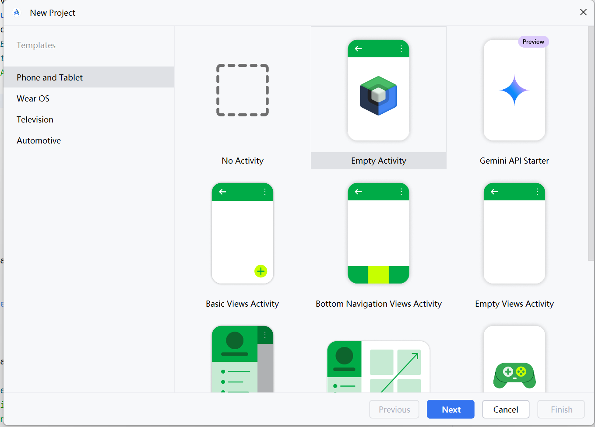

# 实验2_1_构建Kotlin应用并使用 Compose布局

## 一、实验目的

- 掌握使用Kotlin语言开发Android的基本流程
- 掌握Android Compose布局的基本用法
-  进一步熟悉Kotlin语言的特性

---

## 二、实验内容

- 学习基于Kotlin语言的Android开发。
- 任务一：按照教程完成首个Kotlin APP的构建。
- 任务二：按照教程完成Compose布局的实践。

---

## 三、实验步骤

### 任务一：构建首个Kotlin APP

1. 打开 Android Studio，点击 **New Project**。选择 **Empty Activity** 模板。



1. 项目名称设为 `My A`pplication`。语言选择 Kotlin，点击 **Finish** 完成创建。经过编译生成之后，可以看到如下页面：


### 任务二：Compose布局实践

#### 了解可组合函数和 Compose 基础

Jetpack Compose 使用 `@Composable` 注解标记 UI 函数，这些函数可以直接在代码中定义界面，而不依赖 XML。使用 `setContent {}` 可在 `Activity` 中设置界面内容。通过 `@Preview` 注解可以在 Android Studio 中进行 UI 预览。


---

#### 微调界面

文件顶部添加 import 语句：

```kotlin
import androidx.compose.material3.Surface

import androidx.compose.material3.MaterialTheme
```

使用 `Surface` 设置背景颜色，结合 `MaterialTheme.colorScheme.primary`：

```kotlin
@Composable
fun Greeting(name: String, modifier: Modifier = Modifier) {
    Surface(color = MaterialTheme.colorScheme.primary) {
        Text(
            text = "Hello $name!",
            modifier = modifier
        )
    }
}
```

预览的效果：


#### 修饰符

Compose 中常使用 `Modifier` 来调整布局和样式。可在 `modifier` 中加入 `padding` 修饰符，增加元素之间的间距：

```kotlin
import androidx.compose.foundation.layout.padding
import androidx.compose.ui.unit.dp
// ...

@Composable
fun Greeting(name: String, modifier: Modifier = Modifier) {
    Surface(color = MaterialTheme.colorScheme.primary) {
        Text(
            text = "Hello $name!",
            modifier = modifier.padding(24.dp)
        )
    }
}
```


#### 重复使用可组合项

通过定义 `MyApp` 可组合函数，将 `Greeting` 封装起来，使其结构更加清晰，方便复用：

```kotlin
@Composable
fun MyApp(modifier: Modifier = Modifier) {
    Surface(
        modifier = modifier,
        color = MaterialTheme.colorScheme.background
    ) {
        Greeting("Android")
    }
}
```

```kotlin
class MainActivity : ComponentActivity() {
    override fun onCreate(savedInstanceState: Bundle?) {
        super.onCreate(savedInstanceState)
        setContent {
            MyApplicationTheme{
                MyApp(modifier = Modifier.fillMaxSize())
            }
        }
    }
}
```

## 创建Compose中的列（Column）和行（Row）1

Column 中的每个子级都将垂直放置。现在尝试更改Greeting

```kotlin
import androidx.compose.foundation.layout.Column
// ...

@Composable
fun Greeting(name: String, modifier: Modifier = Modifier) {
    Surface(color = MaterialTheme.colorScheme.primary) {
        Column(modifier = modifier.padding(24.dp)) {
            Text(text = "Hello ")
            Text(text = name)
        }
    }
}
```


### Compose 和 Kotlin

可组合函数可以像 Kotlin 中的其他函数一样使用。这会使界面构建变得非常有效，可以添加语句来影响界面的显示方式。
例如，修改之前定义的MyApp

```
@Composable
fun MyApp(
    modifier: Modifier = Modifier,
    names: List<String> = listOf("World", "Compose")
) {
    Column(modifier) {
        for (name in names) {
            Greeting(name = name)
        }
    }
}
```

使用循环向Column中添加元素。效果如下：


当前尚未设置可组合项的尺寸，也未对可组合项的大小添加任何限制，因此每一行仅占用可能的最小空间，预览时的效果也是如此。更改预览效果，以模拟小屏幕手机的常见宽度 320dp。按如下所示向 @Preview 注解添加 widthDp 参数：

```kotlin
@Preview(showBackground = true, widthDp = 320)
@Composable
fun GreetingPreview() {
    BasicsCodelabTheme {
        MyApp()
    }
}
```


接下来为修饰符（modifier）添加更多的属性，来查看显示效果。使用 fillMaxWidth 和 padding 修饰符复制以下布局。注意更改工程中的代码，使用以下代码修改Compose函数。

```
import androidx.compose.foundation.layout.fillMaxWidth

@Composable
fun MyApp(
    modifier: Modifier = Modifier,
    names: List<String> = listOf("World", "Compose")
) {
    Column(modifier = modifier.padding(vertical = 4.dp)) {
        for (name in names) {
            Greeting(name = name)
        }
    }
}

@Composable
fun Greeting(name: String, modifier: Modifier = Modifier) {
    Surface(
        color = MaterialTheme.colorScheme.primary,
        modifier = modifier.padding(vertical = 4.dp, horizontal = 8.dp)
    ) {
        Column(modifier = Modifier.fillMaxWidth().padding(24.dp)) {
            Text(text = "Hello ")
            Text(text = name)
        }
    }
}

```


### 添加按钮

```
import androidx.compose.foundation.layout.Row
import androidx.compose.material3.ElevatedButton
// ...

@Composable
fun Greeting(name: String, modifier: Modifier = Modifier) {
    Surface(
        color = MaterialTheme.colorScheme.primary,
        modifier = modifier.padding(vertical = 4.dp, horizontal = 8.dp)
    ) {
        Row(modifier = Modifier.padding(24.dp)) {
            Column(modifier = Modifier.weight(1f)) {
                Text(text = "Hello ")
                Text(text = name)
            }
            ElevatedButton(
                onClick = { /* TODO */ }
            ) {
                Text("Show more")
            }
        }
    }
}
```


## Compose中的状态（State）

```
import androidx.compose.runtime.mutableStateOf
import androidx.compose.runtime.remember

@Composable
fun Greeting(name: String, modifier: Modifier = Modifier) {
    val expanded = remember { mutableStateOf(false) }
    val extraPadding = if (expanded.value) 48.dp else 0.dp
    Surface(
        color = MaterialTheme.colorScheme.primary,
        modifier = modifier.padding(vertical = 4.dp, horizontal = 8.dp)
    ) {
        Row(modifier = Modifier.padding(24.dp)) {
            Column(
                modifier = Modifier
                    .weight(1f)
                    .padding(bottom = extraPadding)
            ) {
                Text(text = "Hello ")
                Text(text = name)
            }
            ElevatedButton(
                onClick = { expanded.value = !expanded.value }
            ) {
                Text(if (expanded.value) "Show less" else "Show more")
            }
        }
    }
}
```


